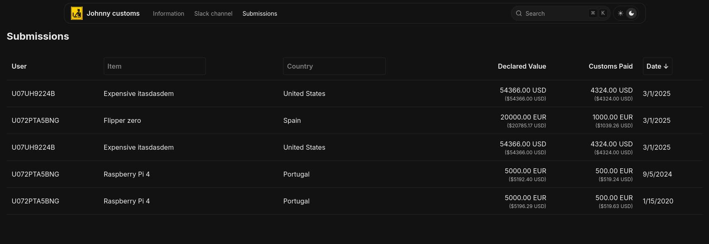
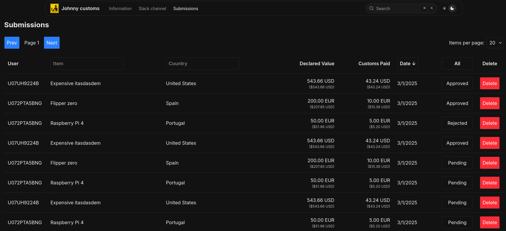
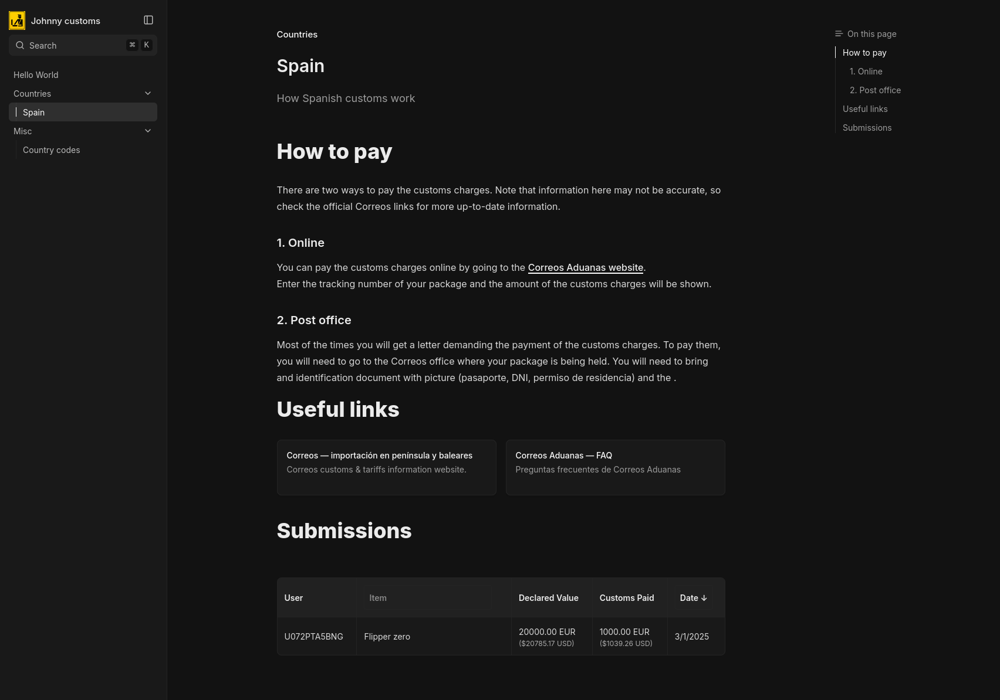

# Johnny customs

Hack-Club AIO customs helper (API, DB, Web, Admin, Slack Bot).

Johnny Customs is an all-in-one solution for managing customs submissions. It includes an API, database, web interface, admin panel, and Slack bot integration.

## Features

- API for managing customs submissions
- Database integration with Drizzle
- Web interface built with Next.js
- Admin panel for managing submissions
- Slack bot for easily adding new submissions

## Images
<details>
<summary>Main Page</summary>


</details>

<details>
<summary>Submissions</summary>


</details>

<details>
<summary>Submissions Admin</summary>


</details>

<details>
<summary>Docs</summary>


</details>

## Installation

### Clone the repository:

```bash
git clone https://github.com/v1ctorio/johnny-customs.git
cd johnny-customs
```

### Install dependencies using yarn

```
yarn
```

### Set up environment variables:
Copy the example environment files and fill in the required values:

```
cp .env.example .env
```

## Running the services
#### API
To start the API server:
```
cd api
yarn start
```
API available at localhost:3000.
#### Bot
To start the Slack bot:
```
cd bot
yarn start
```
#### Website
To start the Next.js development server:
```
cd website
yarn dev
```
Open http://localhost:3001 with your browser to see the result.


## Usage
### API endpoints

### Submissions

#### GET /submissions

**Description:** List all submissions with pagination.

**Query Parameters:**
- `page` (optional): Page number (default: 1)
- `limit` (optional): Number of items per page (default: 20)
- `all` (optional): If true, list all submissions regardless of status

#### GET /submissions/:country

**Description:** List submissions by country with pagination.

**Path Parameters:**
- `country`: Country code (e.g., "US")

**Query Parameters:**
- `page` (optional): Page number (default: 1)
- `limit` (optional): Number of items per page (default: 20)

#### GET /submissions/:id

**Description:** Get a specific submission by ID.

**Path Parameters:**
- `id`: Submission ID

#### POST /submissions/add

**Description:** Add a new submission.

**Request Body:**
- `user`: User ID
- `item`: Item name
- `country_code`: Country code
- `country`: Country name
- `currency`: Currency code
- `declared_value`: Declared value
- `declared_value_usd`: Declared value in USD
- `paid_customs`: Paid customs amount
- `paid_customs_usd`: Paid customs amount in USD
- `additional_information` (optional): Additional information

#### POST /submissions/:id/status/:targetstatus

**Description:** Update the status of a submission.

**Path Parameters:**
- `id`: Submission ID
- `targetstatus`: Target status (approved(1), rejected(2), pending(0))

#### DELETE /submissions/:id

**Description:** Delete a submission by ID.

**Path Parameters:**
- `id`: Submission ID

### Items

#### GET /items

**Description:** Get a list of distinct items.

### Admin

#### POST /admin/checkpassword

**Description:** Check the admin site password (used to secure the admin site).

**Request Body:**
- `password`: Admin site password


## Contributing
Contributions are welcome! Please open an issue or submit a pull request.
