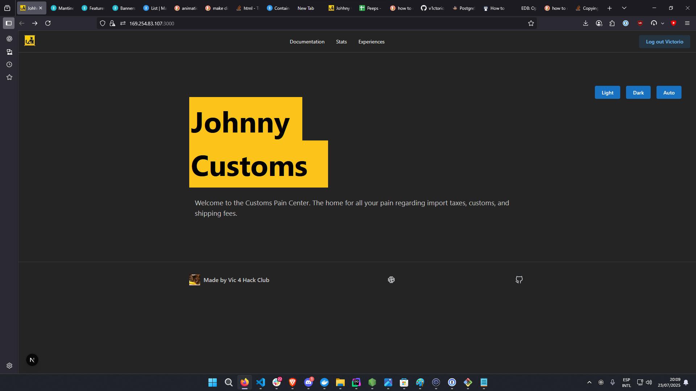

# Johnny Customs

Johnny customs is the next.js typescript web services (includes web frontend, API backend and a slack bot all in one next.js app) that allows worldwide hack-clubbers to share their experiences with customs and import taxes.

It features a database of user-submitted experiences and documentation to help hack-clubbers from all countries understand better how customs works in their country.

See more screenshots in the [assets folder](./assets).

# Features (implemented so far, there will be more)
- Database with table that holds user-submitted experiences with customs and import taxes
- Table that holds items that have been sent to hack-clubbers
- API with endpoints to: get all experiences, get all items, get all countries data (currency,code and emoji), submit new experiences and items 
- A form to submit new experiences and items
- A documentation section to hold documentation regarding each country and its customs