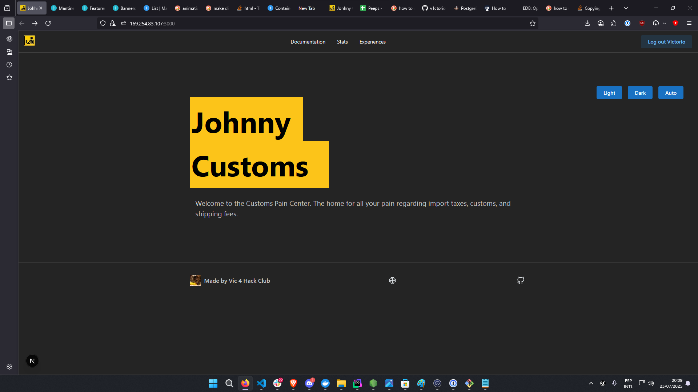
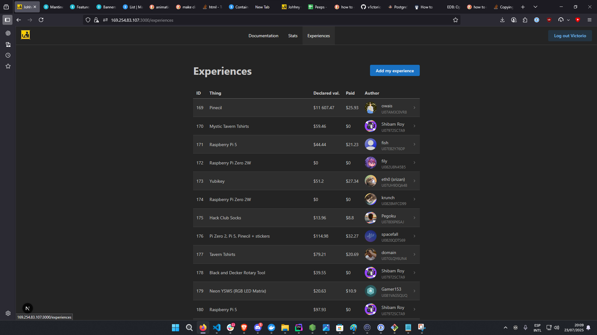

# Johnny Customs


Johnny customs is the next.js typescript web services (includes web frontend, API backend and a slack bot all in one next.js app) that allows worldwide hack-clubbers to share their experiences with customs and import taxes.

It features a database of user-submitted experiences and documentation to help hack-clubbers from all countries understand better how customs works in their country.



See more screenshots in the [assets folder](./assets).

# Features (implemented so far, there will be more)
- Database with table that holds user-submitted experiences with customs and import taxes
- Table that holds items that have been sent to hack-clubbers
- API with endpoints to: get all experiences, get all items, get all countries data (currency,code and emoji), submit new experiences and items 
- A form to submit new experiences and items
- A documentation section to hold documentation regarding each country and its customs

# Development guide 
The project even though it is a monolith, is designed to work along a postgresql database
so you will need to run both the next.js app and a psql db.
#### For a fast psql deployment you can use docker:
```bash
docker run --name johnny-customs-db -e POSTGRES_PASSWORD=himom -p 5432:5432 -d postgres
```
This will create a psql container listenning on port 5432 with a database named `postgres` and postgres with password `himom`.

#### Then you can run the next.js app in dev mode:
For this step you will need to have node.js and yarn installed.
```bash
git clone https://github.com/v1ctorio/johnny-customs.git
cd johnny-customs/johnny-monolith
yarn install 
```
btw. The app will run with https enabled so certain browser features work, so you will need to trust the self-signed certificate created by next.js.


Then you populate the `.env`, you can use this template:
```env
AUTH_SECRET=
SLACK_CLIENT_ID=
SLACK_CLIENT_SECRET=
AUTH_SLACK_ID=
AUTH_SLACK_SECRET=
NEXTAUTH_URL=
JC_ADMIN_API_TOKEN=
```

Now, start the server:
```bash
npm run dev
```

That's it! You can now access the monolith at `https://localhost:3000` and start using it.
